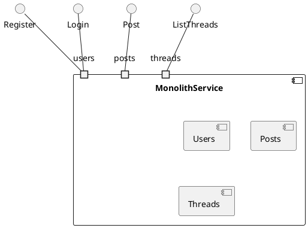
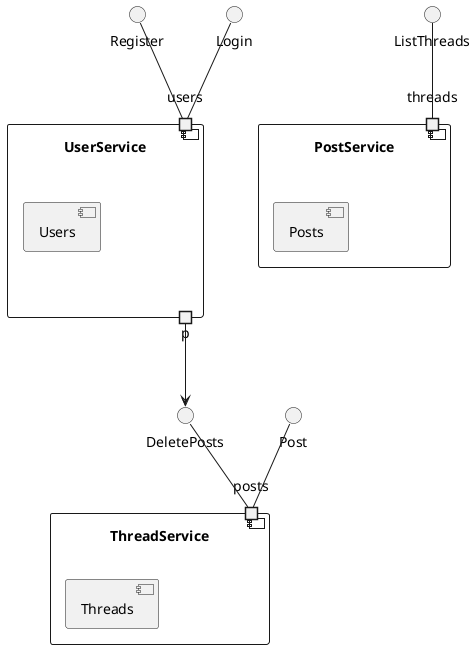
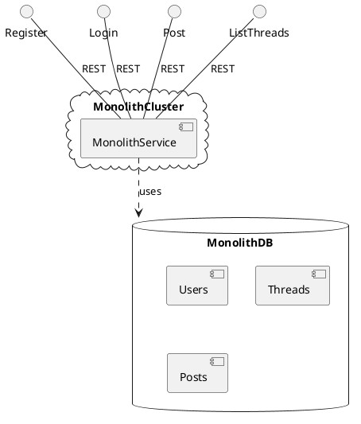
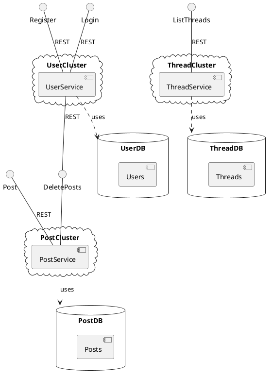
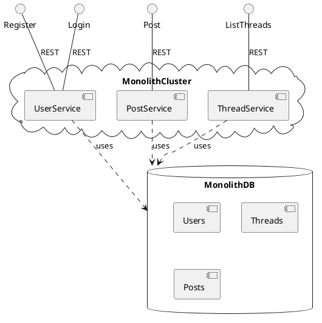

# The Monolith vs Microservices Debate Misses the Point

Trying to decide between a microservices architecture and a monolithic one? The typical advice from articles like [this one from Amazon AWS](https://aws.amazon.com/compare/the-difference-between-monolithic-and-microservices-architecture/) confuses logical and physical architecture and misleads people into thinking it's an either/or choice.

In this article, I'll explain the logical architectures of Amazon's example, show how Amazon translates these into the stereotypical monolithic and microservices deployment architectures, demonstrate an alternative deployment architecture that shows how to blend a microservices logical architecture with a monolithic physical archicture, and then conclude with a discussion of how and why you might want to do this.

## Definitions
Service - A service is a software component with a well defined interface that performs some kind of work on behalf of other software components that interact with the service exclusively through its published interface.

Domain Object - A software component that encapsulates state used by services, and which may refer to and interact with other domain objects used by that same service. Domain objects are private to a service.

## Logical Architecture of a Monolith
This UML 2.0 [Component Diagram](https://developer.ibm.com/articles/the-component-diagram/) shows a more fully fleshed out version of Amazon's hypothetical monolith. The `MonolithService` uses three different models internally to represent its data, and it exposes various interfaces to the outside world to allow managing that state. The example only shows a subset of the interfaces that would be available on a full implementation of such a system.

The MonolithService internally uses multiple domain models, `Users`, `Threads` and `Posts`. The monolith exposes functions for registering users, logging in, posting messages and listing threads, which it implements by manipulating these domains.

In this kind of architecture, it's not unusual for the domains to become tightly coupled, for example modelling a user's posts as a collection on the UserModel. As Amazon mentions, "small changes" like for example changing the structure of the `Users` model can "introduce greater risks" since they can "impact the entire code base". The coupling created at the domain level makes it harder to independently evolve each of these domains independently.

## Evolving the Monolith
The solution to the problems introduced by this coupling is simple - decouple. Each domain now gets its own service, encapsulating its respective models. Any interdependencies between these services are handled via their well-defined public APIs, so if for example the `UserService` needs to delete posts as a result a user being deleted, it must now do this via an explicitly exposed API on the `PostService` like `DeletePosts`.

In this architecture, it becomes possible to independently evolve the implementation of each component without risking the integrity of the entire system.

This looks a lot like the Microservices architecture that Amazon describes, but you'll note that to this point we haven't discussed things like where the components are running, what language they're written in, what protocols they use to communicate with each other, etc. These are considerations for the deployment architecture.

## Monolithic Physical Architecture

## Stereotypical Microservices Architecture

## Decoupled Monolith

