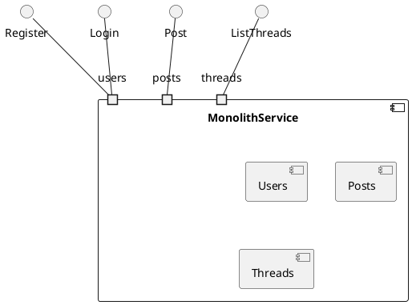
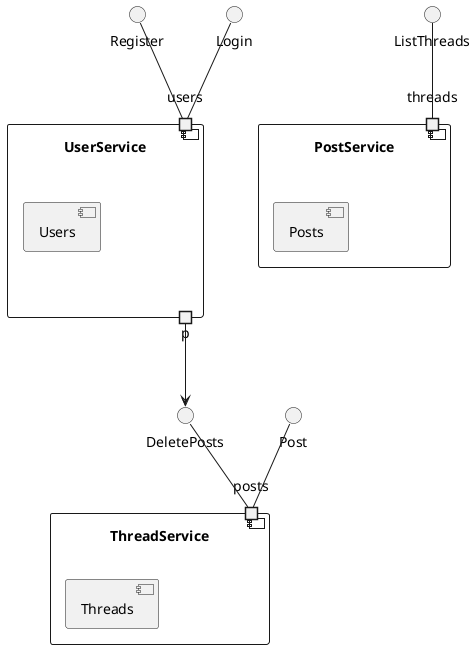
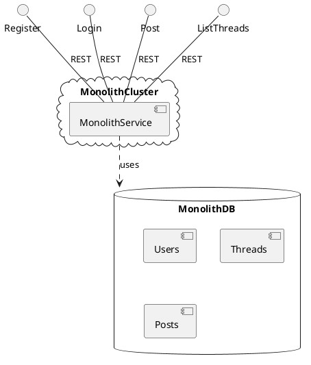
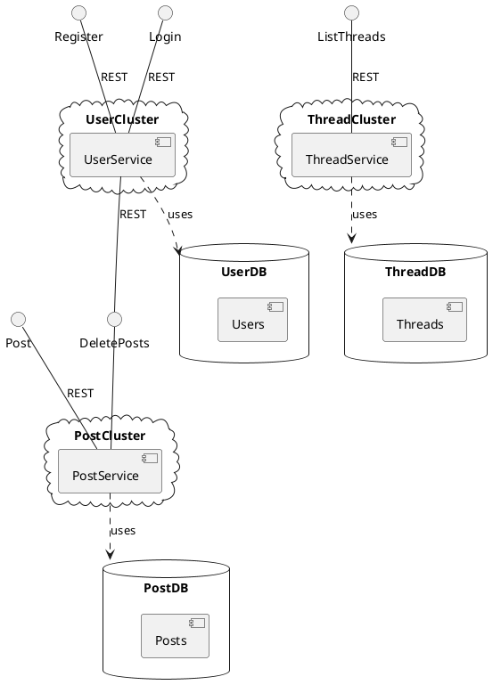
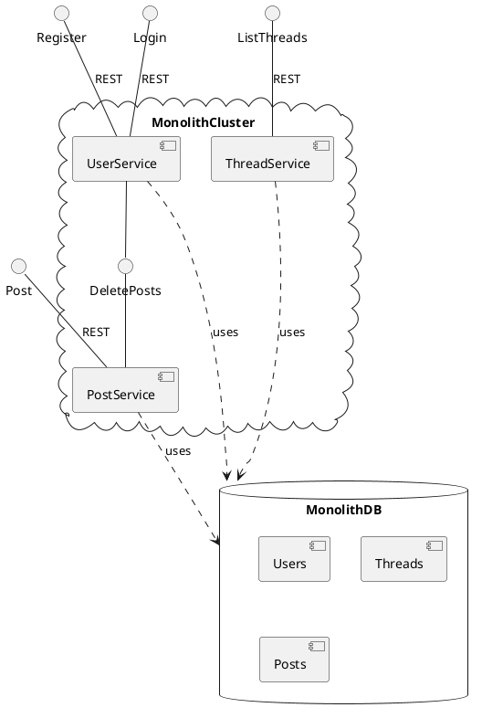

# The Monolith vs Microservices Debate Misses the Point

Trying to decide between a microservices architecture and a monolithic one? The typical advice from articles like [this one from Amazon AWS](https://aws.amazon.com/compare/the-difference-between-monolithic-and-microservices-architecture/) confuses logical and physical architecture and misleads people into thinking it's an either/or choice.

In this article, I'll explain the logical architectures of Amazon's example, show how Amazon translates these into the stereotypical monolithic and microservices deployment architectures, demonstrate an alternative deployment architecture that shows how to blend a microservices logical architecture with a monolithic physical archicture, and then conclude with a discussion of how and why you might want to do this.

## Definitions
Service - A service is a software component with a well defined interface that performs some kind of work on behalf of other software components that interact with the service exclusively through its published interface.

Domain Object - A software component that encapsulates state used by services, and which may refer to and interact with other domain objects used by that same service. Domain objects are private to a service.

## Logical Architecture of a Monolith

This UML 2.0 [Component Diagram](https://developer.ibm.com/articles/the-component-diagram/) shows a more fully fleshed out version of Amazon's hypothetical monolith. The `MonolithService` uses three different models internally to represent its data, and it exposes various interfaces to the outside world to allow managing that state. The example only shows a subset of the interfaces that would be available on a full implementation of such a system.

The MonolithService internally uses multiple domain models, `Users`, `Threads` and `Posts`. The monolith exposes functions for registering users, logging in, posting messages and listing threads, which it implements by manipulating these domains.

In this kind of architecture, it's not unusual for the domains to become tightly coupled, for example modelling a user's posts as a collection on the UserModel. As Amazon mentions, "small changes" like for example changing the structure of the `Users` model can "introduce greater risks" since they can "impact the entire code base". The coupling created at the domain level makes it harder to independently evolve each of these domains independently.

## Evolving the Monolith

The solution to the problems introduced by the coupling in the monolithic architecture is simple - decouple. Each domain now gets its own service, encapsulating its respective models. Any interdependencies between these services are handled via their well-defined public APIs, so if for example the `UserService` needs to delete posts as a result a user being deleted, it must now do this via an explicitly exposed API on the `PostService` like `DeletePosts`.

In this architecture, it becomes possible to independently evolve the implementation of each component without risking the integrity of the entire system.

This looks a lot like the Microservices architecture that Amazon describes, but you'll note that to this point we haven't discussed things like where the components are running, what language they're written in, what protocols they use to communicate with each other, etc. These are considerations for the deployment architecture.

## Monolithic Physical Architecture

This represents a fairly typical deployment of a monolithic service, with a cluster of compute nodes hosting the service itself, a single database storing persistent state, and interfaces exposed via REST over HTTP. There's not a lot to deploy, and because the entire system uses a single database, operations that involve coordination across multiple domain models can easily be performed in a single database transaction. As Amazon notes, this does require all of the service logic to be written in the same language, and because the logical architecture allows for a high degree of coupling between domains, causing the system to become increasingly difficult to evolve and maintain in the future.

## Stereotypical Microservices Architecture

This represents the stereotypical microservices deployment as described by Amazon. Each service gets its own compute cluster and its own database. Interfaces are exposed directly by these services for consumption by clients, or alternately fronted by an [API Gateway](https://microservices.io/patterns/apigateway.html) (not shown). There's more to deploy, but because each service is deployed independently, they can be implemented using different programming languages and scaled independently. A significant downside of this deployment architecture is that operations that involve coordination between services (for example deleting a users' posts when the user is deleted) no cannot be handled atomically with just a simple database transaction. Instead, they require some fairly complicated [gymnastics]
(https://cloud.google.com/architecture/transactional-workflows-microservices-architecture-google-cloud) that can be difficult to implement and even more difficult to debug.

## Decoupled Monolith

This approach deployes a decoupled logical architecture like that from a "microservices" architecture into a physical deployment model more similar to a monolith. This gives the benefits of decoupled services that can be evolved independently without having to worry about affecting the whole system, combined with the simplicity of a monolithic deployment model that avoids the overhead of coordinating services across process boundaries.

## But what about ...

Articles like Amazon's tout various benefits of microservices architecture. Does the Decoupled Monolith deliver on these?

### Innovate faster
Amazon claims that a downside of monolithic architectures is that

> Developers cannot rebuild certain parts of the code base with new technological frameworks, which delays your organization in adopting modern technological trends.

I'll confess here that I have a bias against frameworks. In my experience, frameworks like Spring, Django, etc are a crutch that helps projects get off the ground quickly but that ends up slowing them down in the long term. Because frameworks seek to own your application, they are indeed difficult to replace. In the Go world, we tend to avoid frameworks and focus instead on using smaller libraries that are easily interchangable. It's rate that a "new shiny thing" comes along that confers a significant advantage over what came before, but in a properly architected application, it's not usually too hard to swap it in, and furthermore, if it's worth swapping in in one place, it's probably worth swapping in across the board.

The other aspect to consider here is team flexbility. If you build teams focused around small services, depending on upcoming work, some of these teams will inevitably end up overstaffed and others understaffed. If each team writes their microservice using a completely unique stack, with different programming languages and drastically different design patterns, balancing developer resources across these projects becomes considerably more difficult. By contrast, in a decoupled monolith where all services are written in the same language, using the same core libraries and patterns, anyone can step in anywhere at any time.

### Reduce risks
Amazon states that in a monolithic application

> A minor error in the code base can cause the whole application to fail. Such incidents have the potential to cause severe service outages and affect all active users.

The decoupled monolith significantly mitigates this by avoiding coupling of the domain models.

### Accelerate time to market
Per Amazon, a microservices architecture accelerates development because

> each developer focuses on a smaller chunk of code instead of a large one. When developers create a specific microservice, they don't need to understand how other microservices work. They only need to use the appropriate APIs, which are faster and easier to learn.

### Reduce total cost of ownership
According to Amazon

> You can scale microservice applications horizontally by adding compute resources on demand. You only have to add resources for the individual service, not the entire application. To scale monolithic systems, companies must upgrade memory and processing power for the application as a whole, which is more expensive. 

This is true only in as much as your services can't scale horizontally. Making the compute cluster scale horizontally is usually not too hard, and even the database tier can be scaled horizontally using technologies like Google's [Cloud Spanner](https://cloud.google.com/spanner) or Amazon's own [Aurora](https://aws.amazon.com/rds/aurora/). Admittedly, these are not without their own complexities, but the days of applications that can't scale horizontally are in the past.

## The Escape Hatch
