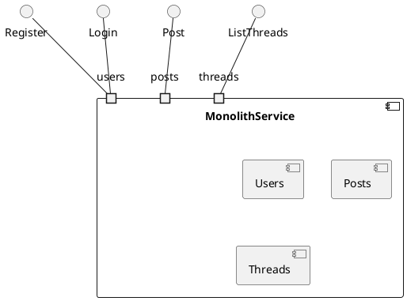
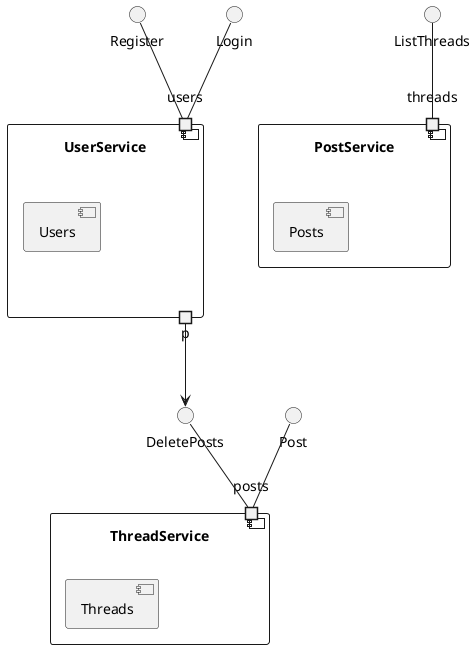
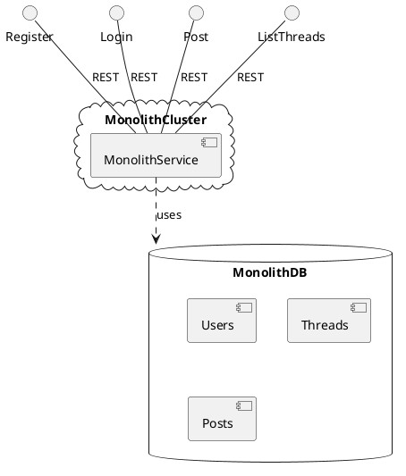

# The Monolith vs Microservices Debate Misses the Point

Percy Wegmann (August 2023)

So, you need to build a system that exposes some web services. You're trying to decide between a microservices architecture and a monolithic one. The typical advice from organizations like [Amazon AWS](https://aws.amazon.com/compare/the-difference-between-monolithic-and-microservices-architecture/) and [Atlassian](https://www.atlassian.com/microservices/microservices-architecture/microservices-vs-monolith) confuses logical and physical architecture and gives the false impression that it's purely an either/or choice. By thinking of the logical and physical architecture separately, we empower ourselves to design solutions that meet the unique needs of our own organizations.

In this article, I'll explain the logical architecture of Amazon's example, show how Amazon translates this logical architecture into the stereotypical monolithic and microservices deployment architectures, demonstrate an alternative deployment architecture that shows how to blend a microservices logical architecture with a monolithic physical archicture, discuss the benefits of such an approach in the context of the claimed benefits of microservices, and finish with some thoughts on where each style of deployment may be appropriate.

## Definitions
Service - A software component with a well defined interface that performs some kind of work on behalf of other software components that interact with the service exclusively through its published interface.

Domain Object - A software component that encapsulates state used by services, and which may refer to and interact with other domain objects used by that same service. Domain objects are private to a service and invisible to other services.

## Logical Architecture of a Monolith

This UML 2.0 [Component Diagram](https://developer.ibm.com/articles/the-component-diagram/) shows a more fully fleshed out version of Amazon's hypothetical monolith. The `MonolithService` uses three different domain objects internally to represent its data, and it exposes various interfaces to the outside world to allow managing that state. The example only shows a subset of the interfaces that would be available on a full implementation of such a system.

The MonolithService internally uses multiple domain objects, `Users`, `Threads` and `Posts`. The monolith exposes functions for registering users, logging in, posting messages and listing threads, which it implements by manipulating these domain objects.

In this kind of architecture, it's not unusual for the domain objects to become tightly coupled, for example modeling a user's posts as a list on the user domain object. As Amazon mentions, "small changes" like altering the structure of the `Users` model can "introduce greater risks" since they can "impact the entire code base". Such coupling created at the domain level also makes it harder to independently evolve each of these domains independently, leading to a system that becomes more and more difficult to maintain over time.

## Decoupling the Monolith

We can solve the coupling inherent in the monolithic architecture by ... decoupling! Each area of the system now gets its own service, encapsulating its respective domain objects. Any interdependencies between these services are handled via their well-defined public APIs, so if for example the `UserService` needs to delete posts as a result of a user being deleted, it must now do this via an explicitly exposed API on the `PostService` like `DeletePosts`.

In this architecture, it becomes possible to independently evolve the implementation of each component without risking the integrity of the entire system.

This looks a lot like the Microservices architecture that Amazon describes, but you'll note that we haven't yet discussed things like where the components are running, what language they're written in, what protocols they use to communicate with each other and their clients, etc. These are considerations addressed by the deployment architecture.

## Monolithic Physical Architecture

This represents a fairly typical deployment of a monolithic service, with a cluster of compute nodes hosting the service itself, a single database storing persistent state, and interfaces exposed via REST over HTTP. There's not a lot to deploy, and because the entire system uses a single database, operations that involve coordination across multiple domain models can easily be performed in a single database transaction. As Amazon notes, this does typically require that all of the service logic to be written in the same language, and because the logical architecture allows for a high degree of coupling between domains, the system can grow increasingly difficult to evolve and maintain in the future.

## Stereotypical Microservices Architecture

This represents the stereotypical microservices deployment. Each service gets its own compute cluster (whether physical or containerized) and its own database. These services expose interfaces for consumption by clients, which may be fronted by an [API Gateway](https://microservices.io/patterns/apigateway.html) (not shown). There's more to deploy, but because each service is deployed independently, they can be implemented using different programming languages and tech stacks, and scaled independently. Unfortunately, operations that involve coordination between services (for example deleting a users' posts when the user is deleted) now can't be handled atomically with just a simple database transaction. Instead, they require some fairly complicated [gymnastics](https://cloud.google.com/architecture/transactional-workflows-microservices-architecture-google-cloud) that can be difficult to implement and even more difficult to monitor and debug.

## Decoupled Monolith

This approach deploys a decoupled microservices-like logical architecture into a physical architecture more similar to a monolith. This gives the benefits of decoupled services that can evolve independently without having to worry about affecting the whole system, combined with the simplicity of a monolithic deployment model that avoids the overhead of coordinating services across process boundaries. The services are still "micro", they just happen to run in the same process space.

## But what about ...

Typical articles about microservices architectures tout various benefits. Does the Decoupled Monolith deliver on these?

### Innovate faster
Amazon claims that a downside of monolithic architectures is that

> Developers cannot rebuild certain parts of the code base with new technological frameworks, which delays your organization in adopting modern technological trends.

I'll confess here that I have a bias against frameworks. In my experience, frameworks like Spring, Django, etc are a crutch that helps projects get off the ground quickly but that ends up slowing them down in the long term. Because frameworks determine the overall structure of your application and aren't typically made to be readily interchangeable, they are indeed difficult to replace. In the Go world, we tend to avoid frameworks and focus instead on using smaller libraries that are easily swapped out. It's rare that a "new shiny thing" comes along that confers a significant advantage over what came before, but in a properly architected application, it's not too hard to swap it in. Furthermore, if something convincingly superior comes along, why limit its benefits to just one of your services instead of applying it across the board?

The other aspect to consider here is team flexbility. Maybe you work in a giant company where each "microservice" has a team of 10 engineers working on it, but in a smaller company and especally a startup, developers often need to wear many hats. Have you ever had to step into a system using a different language, different design patterns, and/or different deployment environments in order to help out with the latest priority project? In my experience, that's the exact opposite of fast. By contrast, in a decoupled monolith, everything tends towards consistency, allowing any developer to step into any service as projects demand and staffing allows. That's agility.

### Reduce risks
Amazon states that in a monolithic application

> A minor error in the code base can cause the whole application to fail. Such incidents have the potential to cause severe service outages and affect all active users.

Furthermore

> when developers introduce new changes to a monolithic application, they must retest and redeploy the entire system

Microservices aren't immune to this. What happens in the example system if the User service goes down and people can't log in anymore, or the Thread service goes down and users can't view threads anymore? Is that a significantly better user experience than the entire site going down? And what's so bad about retesting an entire system if one component changes? That's a good practice no matter what your architecture, and if you have good test coverage and thoughtfully implemented tests that can run in parallel, complete relatively quickly and don't fail spuriously, running tests should be something to cherish, not to avoid. And oh by the way, if your tests don't have to simulate interactions across process boundaries in a complex microservices architecture, they'll likely be easier to write and quicker to execute anyway.

### Accelerate time to market
Per Amazon, a microservices architecture accelerates development because

> each developer focuses on a smaller chunk of code instead of a large one. When developers create a specific microservice, they don't need to understand how other microservices work. They only need to use the appropriate APIs, which are faster and easier to learn.

This is almost exclusively the result of applying the microservices pattern to the logical architecture. In the decoupled monolith, developers can focus on specific services too, and don't need to know about the implementation details of other services, since their services interact purely at the level of interfaces. They do need to know about shared components like logging libraries, but being able to reuse boilerplate stuff like that is more of a benefit than a burden--the cognitive load is limited to understanding and consistently applying corporate standard programming patterns, not having to understand all of the corporations systems in detail.

### Reduce total cost of ownership
According to Amazon

> You can scale microservice applications horizontally by adding compute resources on demand. You only have to add resources for the individual service, not the entire application. To scale monolithic systems, companies must upgrade memory and processing power for the application as a whole, which is more expensive. 

This is true only in as much as your services can't scale horizontally. Making the compute cluster scale horizontally is usually not too hard, and even the database tier can be scaled horizontally using technologies like Google's [Cloud Spanner](https://cloud.google.com/spanner) or Amazon's own [Aurora](https://aws.amazon.com/rds/aurora/). Admittedly, these are not without their own complexities, but the days of applications that can't scale horizontally have largely passed.

## The escape hatch
So what happens if you do have a service that can't scale horizontally, or a service that absolutely has to be written in a specific language or deployed into a specific, unique environment? Go ahead, factor it out of the monolith. Since services in the decoupled monolith communicate with each other through interfaces, aside from maybe participating in the same database transaction, they largely don't care whether they're in the same process or not. But, just because you may have one or two services that benefit from this style of deployment doesn't mean that the rest of the system has to be split apart.

## What situations might warrant a microservices deployment architecture?
You'll notice that the Amazon example we've worked with involves a relatively tightly focused system that largely depends on all three parts of it working in concert. Similarly, the example of Netflix cited by the Atlassian article is really just one application - a video streaming platform.

Atlassian's own experience is meaningfully different. Atlassian operates a suite of products including bug tracking, version control, project management, incident management and others. These products are only loosely related in that they share a user model and can link to each other in useful ways (for example, a bug can link to a pull request in the source repository). You can imagine that such links can also exist to/from external alternatives to these apps, so for example you could link from a Jira ticket to a GitHub PR. This means that in practice, these applications are extremely loosely coupled the way that different websites and applications are loosely coupled on the internet.

From an organizational perspective, each Atlassian application probably has its own product and project managers, its own development team, its own schedule, and so on. In this case, does it make sense to force all of them to coordinate in a single source repo and deploy to a single cluster, or does it make more sense to allow them to develop and deploy independently? Probably the latter. Is that a "microservices" architecture, or is that just a very large company with each division running its own monolith on some shared infrastructure like a Kubernetes cluster? I'm not sure the distinction matters.

Ultimately, it's not an either/or choice between microservices or monoliths. First, figure out whether you're dealing with one system (like a user forum or video streaming service), or multiple systems (like Atlassian's suite of products). Then, for each system, start by designing a logical architecture that factors the system well and makes it easy to evolve and maintain. Lastly, figure out how to deploy this logical architecture into a physical architecture that minimizes complexity while still meeting your scalability needs. If the resulting system doesn't fit neatly into one of the stereotypical boxes, congratulations, you've just designed something appropriate to your own needs!
